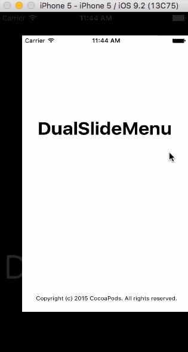
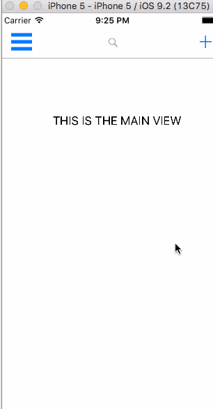

#DualSlideMenu

[](http://cocoapods.org/pods/DualSlideMenu)
[](http://cocoapods.org/pods/DualSlideMenu)
[](http://cocoapods.org/pods/DualSlideMenu)

Left and right slide menu to keep your main view clutter free

##Table of Contents
- [Why use this](#why-use-this) 
- [Demo](#demo) 
- [Tutorial](#tutorial)
  - [Requirements](#requirements)
  - [Installation and Walkthrough](#installation)
- [Delegate Methods](#delegate-methods) 
- [Complete API](#complete-api) 
- [Contributions](#contributions) 
- [Author](#author) 
- [License](#license) 

##Why use this

* Declutters your main view by add more real estate to your app
* Adds simple animations to improve UX
* Lots of documentation for methods and function to improve usability
* Easy for customization
* Your app can look like Slack's, Facebook's and many of Google's apps

##Demo



##Tutorial

To run the example project, clone the repo, and run `pod install` from the Example directory first. Then, run the example project and check out the example.

### Requirements

### Installation

#####DualSlideMenu is available through [CocoaPods](http://cocoapods.org). To install
it, simply add the following line to your Podfile:

```ruby
pod "DualSlideMenu"
```

#####Create a main view controller, which can be considered the home view of the app, and two other view controllers which will be the left and the right side menus. Then add an identifier for the three view controllers which will be used in the AppDelegate.


#####In your AppDelegate file, add the pod to the file. 
  ```swift
  import DualSlideMenu
  ```

#####Then, initialize and add the three view controllers to the container class using the identifers from above

  ```swift
  var window: UIWindow?
  var storyboard: UIStoryboard?


  func application(application: UIApplication, didFinishLaunchingWithOptions launchOptions: [NSObject: AnyObject]?) -> Bool {
    window = UIWindow(frame: UIScreen.mainScreen().bounds)
      storyboard = UIStoryboard(name: "Main", bundle: nil)


      let leftView = storyboard?.instantiateViewControllerWithIdentifier("LeftMenuController")
      let rightView = storyboard?.instantiateViewControllerWithIdentifier("RightMenuController")
      let mainView = storyboard?.instantiateViewControllerWithIdentifier("MainController")

      let controller = DualSlideMenuViewController(mainViewController: mainView!, leftMenuViewController: leftView!, rightMenuViewController: rightView!)
      window!.rootViewController = controller
      window!.makeKeyAndVisible()
      return true
  }

```

#####If you only want to use a certain side for a menu then initialize using the following method 

```swift
let leftView = storyboard?.instantiateViewControllerWithIdentifier("LeftMenuController")
let mainView = storyboard?.instantiateViewControllerWithIdentifier("MainController")

let controller = DualSlideMenuViewController(mainViewController: mainView!, leftMenuViewController: leftView!)

```

#####The width of display for the side menus can be changed by adding this line of code to your AppDelegate inside of the didFinishLaunchWithOptions method. The offset must be added for both left and right side menu

```swift
controller.leftSideOffset = 200
controller.rightSideOffset = 200
//200 represents the width of the main view when the side menu is present
```

#####If you decide to add other actions to open the menu such as a hamburger button, then just call the toggle method of DualSlideMenuViewController with the parameter of which direction the main view should move. I know its counterintuitive, but think of the parameter not as where the side view appears but where the main view is moving towards
```swift
controller.toggle('right')
//This will open the left side view and move the main view to the RIGHT (KEYWORD)
```

#####Switching views without animation
```swift
controller.toMain() // main view appears without animation
controller.toLeft() // left view appears without animation
controller.toRight() // right view appears without animation
```

#####On the other hand, if you wanted to animate to the main view with actual animations
```swift
controller.collapseAll()
```

#####If you wanted to add swipe gestures in the side menus, you can now do so
```swift
controller.addSwipeGestureInSide(rightView!, direction: .Right)
controller.addSwipeGestureInSide(leftView!, direction: .Left)
```

###Delegate Methods

```swift
func onSwipe() {
  // Called when the user has swiped from any view
}

func didChangeView() {
  // Called when asynchronous animation has completed
}
```

###Complete API 
[[Back to Top](#dualslidemenu)]

```swift
  // Initializers
  public convenience init(mainViewController: UIViewController, leftMenuViewController: UIViewController)
  public convenience init (mainViewController: UIViewController, rightMenuViewController: UIViewController)
  public convenience init(mainViewController: UIViewController, leftMenuViewController: UIViewController, rightMenuViewController: UIViewController) 

  /**
    Add swipe gestures in side view
    Useful when side view takes up the whole screen so the only way to navigate to home is with this swipe gesture

    - parameter viewController: the view controller that a recognizer will be added to
    - parameter direction:      the direction of type UISwipeGestureRecognizierDirection
   */
  public func addSwipeGestureInSide(viewController: UIViewController, direction: UISwipeGestureRecognizerDirection)

  /**
    Main toggle function that controls navigation of side menu

    - parameter swipeDirection: the direction of the swipe
    ex. "left" or "right" where swiping from left to right is a "right" swipe
   */
  public func toggle(swipeDirection: String)

  /**
    This is an escape method that will animate to the main view no matter what view the app is currently in

    This method will not animate the transition, so the main view will appear in view instantly
    Up to developers to decide which to use for their use case
   */
  public func toMain()

  /**
    Similar to toMain, except instantly animates to left menu
   */
  public func toLeft()

  /**
    Similar to toMain, except instantly animates to right menu
   */
  public func toRight() 

  /**
    Will move to main view from either left or right menu.
    Pretty straight forward, this is a cleaner implementation of toMain and does include animations
    Up to developers to decide to fit their use case
   */
  public func collapseAll() 

```


##Walkthrough of new swipe gesture recognizers
[[Back to Top](#dualslidemenu)]
<br>
  

## Contributions
[[Back to Top](#dualslidemenu)]
  I am happy to accept any open contributions. Just fork this project, make the changes and submit a pull request.

## Author
[[Back to Top](#dualslidemenu)]

  Vincent Le, vinnyoodles@gmail.com

## License
[[Back to Top](#dualslidemenu)]

  DualSlideMenu is available under the MIT license. See the LICENSE file for more info.
